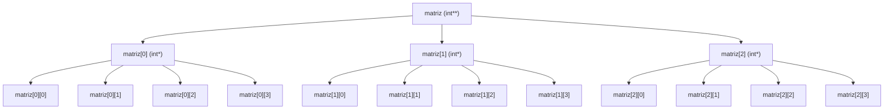

# Representacion grafica de `int** matriz`

Ejemplo visual para una matriz dinamica con `F = 3` filas y `C = 4` columnas.

`new int*[filas]` crea el arreglo de punteros a filas.  
`new int[columnas]` dentro del `for` crea las columnas de cada fila.
